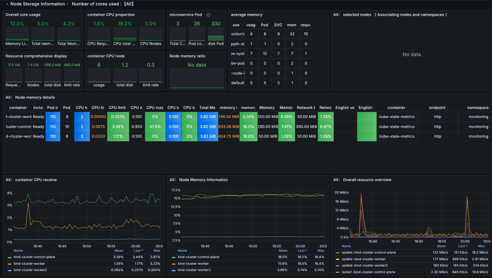

# K8s Kind Voting App

## Overview
This guide provides a step-by-step walkthrough for deploying a Kubernetes cluster using Kind on an AWS EC2 instance, setting up Argo CD for continuous deployment, and deploying applications.

### Steps covered:
1. Launch an AWS EC2 instance.
2. Install Docker and Kind.
3. Create a Kubernetes cluster with Kind.
4. Install and configure `kubectl`.
5. Set up the Kubernetes Dashboard.
6. Install and configure Argo CD.
7. Manage your Kubernetes cluster and applications with Argo CD.

## Architecture
This app architecture consists of:

- **Frontend Web App**: Python-based app that lets users vote between two options.
- **Redis**: A key-value store that collects new votes.
- **.NET Worker**: Consumes votes from Redis and stores them in a database.
- **Postgres Database**: Stores votes, backed by a Docker volume.
- **Node.js Web App**: Displays voting results in real-time.

## Observability
This project also incorporates monitoring tools:

- **Grafana**: For creating and viewing custom dashboards.
- **Prometheus**: For collecting and monitoring metrics from the system.

### Diagrams:
- **Architecture Diagram**: Depicts the app structure and flow.
- **Grafana Diagram**: Visual representation of Grafana’s monitoring setup.
- **Prometheus Diagram**: Shows how Prometheus is configured for monitoring.

- **Argo CD 

- **Prometheus**: For collecting and monitoring metrics from the system.

- **Grafana**: For creating and viewing custom dashboards.

